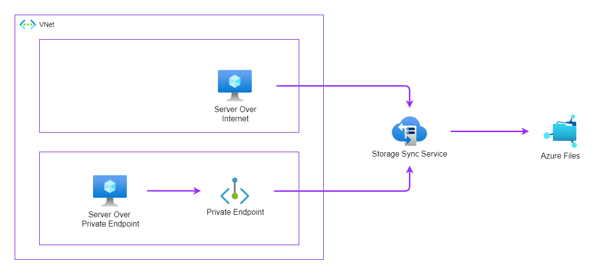

# Azure Examples
Terraform examples for Azure Infrastructure

## [Azure VM Monitoring](./azure-vm-monitoring/README.md)

## [Azure File Sync](./azure-file-sync/README.md)

## [VPN gateway transit for virtual network peering](https://learn.microsoft.com/en-us/azure/vpn-gateway/vpn-gateway-peering-gateway-transit)

## [Azure Virtual Hub with Firewall](./azure-file-sync/README.md)

## [Azure Policy](./azure-file-sync/README.md)

## [Azure Kubernetes](./azure-file-sync/README.md)
